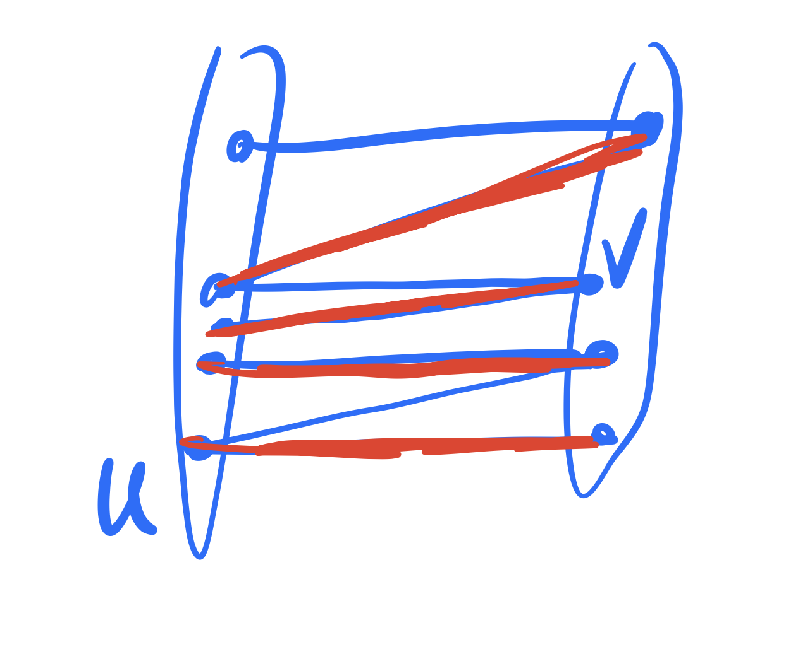
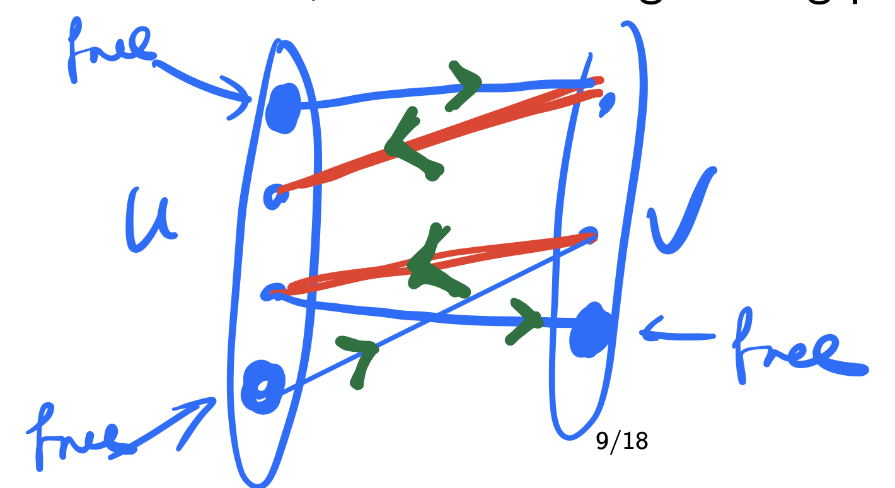

# Maximum Matching in a Bipartite Graph

The `maximum matching` problem in a bipartite graph involves finding the largest possible set of edges such that no two edges share a vertex. The Hopcroft-Karp algorithm provides an efficient way to solve this problem.

    <figure>
        
        <figcaption>Above bipartite graph has a maximum matching size of 4.</figcaption>
    </figure>

    <figure>
        
        <figcaption>Above bipartite graph has a maximum matching size of 3.</figcaption>
    </figure>

## Hopcroft-Karp Algorithm

### Algorithm
1. Initialize all vertices in sets \( U \) and \( V \) as unmatched.
2. Perform a Breadth-First Search (BFS) to find the shortest augmenting paths from free vertices in \( U \) to free vertices in \( V \).
3. Perform a Depth-First Search (DFS) to augment the matching using the paths found in the BFS step.
4. Repeat steps 2 and 3 until no more augmenting paths are found.

### Steps

1. **Initialization**:
   - Create dictionaries `pair_U` and `pair_V` to keep track of the matches in \( U \) and \( V \) respectively, initialized to `NIL` (unmatched).
   - Create a distance dictionary `dist` to store the distances for BFS.

2. **BFS (Breadth-First Search)**:
   - Initialize a queue and set the distance of all free vertices in \( U \) to 0.
   - For each vertex in the queue, explore its neighbors and update their distances if they are unmatched or if a shorter path is found.

3. **DFS (Depth-First Search)**:
   - For each free vertex in \( U \), try to find an augmenting path using DFS.
   - Update the matching by flipping the matched and unmatched edges along the path.

4. **Repeat**:
   - Continue the BFS and DFS steps until no more augmenting paths can be found.

### How to Check for Augmenting Paths
1. During BFS, maintain a queue to explore the graph level by level.
2. During DFS, recursively explore neighbors, ensuring the path follows the distances calculated in BFS.

### Time Complexity
* The BFS and DFS steps each run in `O(E)` time.
* The algorithm performs `O(√V)` iterations.
* Total time complexity: `O(E√V)`.

