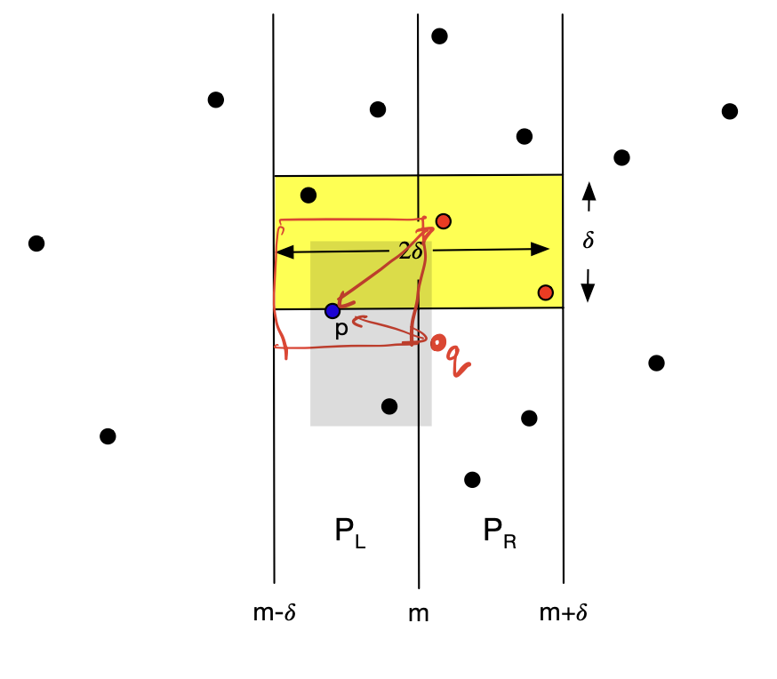

# Distance between closest pair of points using divide and conquer approach

Given a list `points` consisting of `n` points in the `x-y` plane, such that no two points are same, the algorithm uses divide and conquer approach to find the distance between the closest pair of points in the x-y plane. The naive implementation is pretty straight forward and computes the result in `O(n^2)`.

## Algorithm
1. Sort the points based on x and y coordinate values and store in `x_sorted_points` and `y_sorted_points`, pass both lists to recursion algorithm. We will recursively split `x_sorted_points` to find the minimum distance in each half (step 3) and we will use `y_sorted_points` to calculate distance between points located in different halves (step 4).
2. When `n<=3`, compute distance between all the pairs, this will be achieved in constant time.
3. Otherwise, recursively divide `P` into two halves with a vertical line `x=m` such that this both halves have `n/2` points. Compute the minimum distance for each half `d_l, d_r`and get the minimum of the two, i.e., `d = min(d_l, d_r)`.
4. Now we need to consider the case, where two points might be located on different halves. All such pairs of points must be enclosed with the range `x = m - d` and `x = m + d`. Filter out such points, otherwise distance between such points will be greater than `d`. Refer below image (Taken from Prof. Andrew McGregor's COMPSCI-611 lecture slides). Use `y_sorted_point` for filtering.

    

5. Claim - for any point `p`, it is sufficient to compare it with 6 other points within `d` distance to cover all points. For detailed explanation, refer [Prof. Andrew McGregor's lecture slides](https://people.cs.umass.edu/~mcgregor/611S24/lec02.pdf).

6. Using above claim, we compare each point with the next 6 points in the sorted order of y-coordinate and store it in `d_m` ( The list of points for comparison is already computed in step 4, `points_m`, it contains points in sorted order of y coordinates).
7. Return `min(d, d_m)`.

## Time Complexity
* Sorting the list by x and y coordinates take `O(nlogn)` steps each.
* The divide and conquer algorithm convers the problem of size `n` into two sub-problems of size `n/2` and combines the solutions in linear time `O(n)` steps.
* The time complexity can be derived using the Master's theorem where a=2, b=2, and α = 1.
* Time complexity, `T(n) = nlog(n)`.