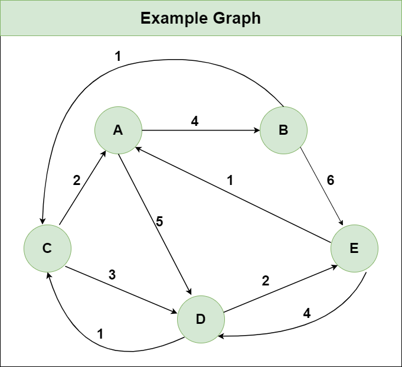

# Dynamic Programming

## Knapsack (Unweighted)
Given a set of `n` items and a sack with a capacity `C`, the knapsack algorithm uses dynamic programming approach to find the maximum possible items that can be carried in the sack without exceeding its capacity.

### Time Complexity
* The construction of the dynamic programming table requires two loops which is done in `O(nC)` steps. Hence the time complexity is `O(nC)`.

## Floyd-Warshals Algorithm
Floyd-Warshall algorithm is a graph analysis algorithm used to find the shortest paths between all pairs of nodes in a weighted graph.

    <figure>
        
        <figcaption>Sample Graph 1.</figcaption>
    </figure>

### Time Complexity
* The construction of the dynamic programming table requires three loops which is done in `O(n^3)` steps. Hence the time complexity is `O(n^3)`