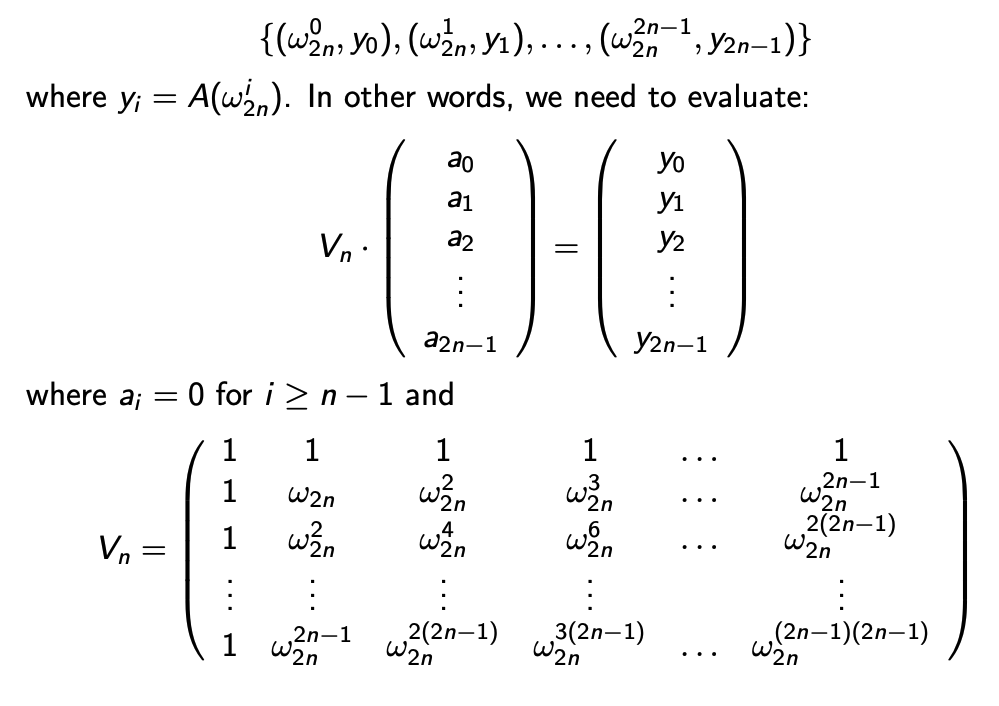
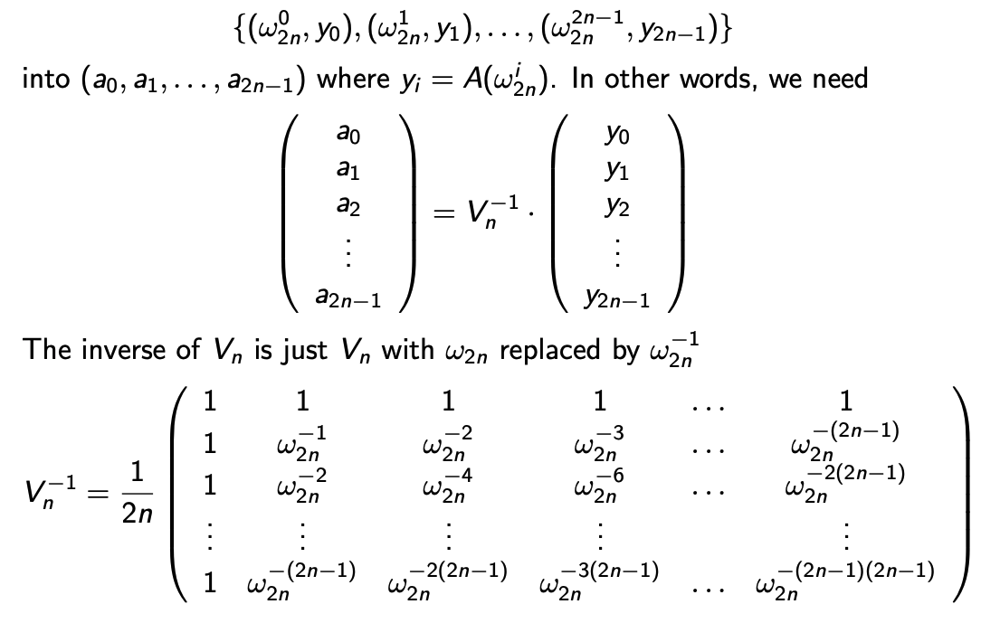

# Fast Polynomial Multiplication

Given two polynomial `A(x)` and `B(x)` of degree `n-1` (assuming degree of both `A` and `B` is same and **n is a power of 2**), the algorithm uses divide and conquer approach to perform multiplication of the polynomaials. The naive implementation is pretty straight forward and computes the result in result in `O(n^2)`.

## Algorithm
* Input: Coeffcient representation of `A(x)` and `B(x)`.
1. Transform into PVR by evaluating on at least `2n - 1` points.
2. Multiply polynomials to get `C(x)` in PVR.
3. Transform PVR of `C(x)` back into CR.

### Transform Coefficient Representation into PVR (Point Value Representation) 
* Given a polynomial `A(x) = 1 + 2x + 2x^2`. Its coefficient representation is given by `[1, 2, 2]`. And its PVR is given by `(x, A(x))` which is computed by evaluating `A(x)` for various values of `x`. For example, `(0, 1), (1, 4), (2, 9)` is PVR for `A(x)`.

1. Express `A(x) = A_even(x^2) + x * A_odd(x^2)` recursively using divide and conquer. Evaulate `A(x)` at 2n-th roots of unity. n-th roots of unity follow the Halving Lemma, due to which the squares of the 2n-th roots of unity are two copies of n-th roots of unity. We use this property of the n-th roots of unity to evaluate `A(x)` on atleast `2n - 1` points which is ultimately at most n times.

### Transform PVR into Coefficient Represetnation 

* We have a polynomial `A` of degree `2n-1` evulated on atleast `2n-1` points. And so far, we have performed the following multiplication to obtain the vector `y` as shown below. here `y = A(x)` (Taken from Prof. Andrew McGregor's COMPSCI-611 lecture slides).

    

1. To convert PVR back to Coefficient Representation, we compute the inverse `V^-1` and use it to compute `A(x)` as shown below.

    

For detailed explanation, refer [Prof. Andrew McGregor's lecture slides](https://people.cs.umass.edu/~mcgregor/611S24/lec03.pdf).

## Time Complexity
* Step 1 uses divide and conquer approach to evaluate degree `n-1` polynomial at `2n-th` roots of unity, and can be completed in `O(nlogn)` steps. The time complexity can be derived using the Master's theorem where a=2, b=2, and α = 1.
* Step 2 can be compute in `O(n)` steps.
* Step 3 is reverse of step 1 and is follows a similar procedure. So it takes `O(nlogn)` steps.
* Time complexity, `T(n) = nlog(n) + n + nlogn = O(nlogn)` steps.