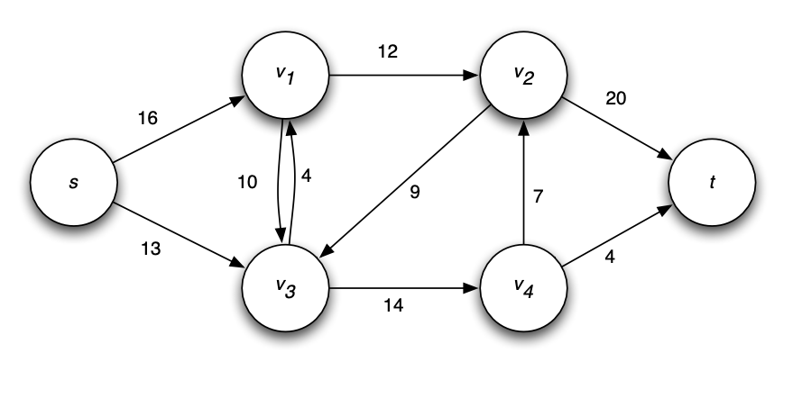

# Ford-Fulkerson's Algorithm to find Maximum flow

Given a network flow, `G(V, E)`, a source node and a sink, the Ford-Fulkerson's algorithm finds the maximum flow that can be passed from the source to the sink, while following the flow constraints.

    <figure>
        
        <figcaption>Sample Flow 1.</figcaption>
    </figure>

## Algorithm 

* flow `f = 0`.
* while there exists an augmenting path `p` for `f`.
    * find shortest (unweighted) augmenting path `p`.
    * augment `f` by `b(p)` units along p. (`b(p)` is known as the bottlenexk of the path, which is the lowest capacity along a path.).
* return `f`.

## Time Complexity

The algorithm finds a maximum flow in time `O(|E|^2 * |V|)` steps.

