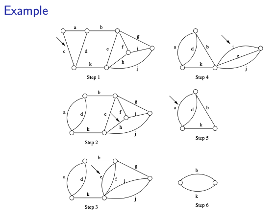
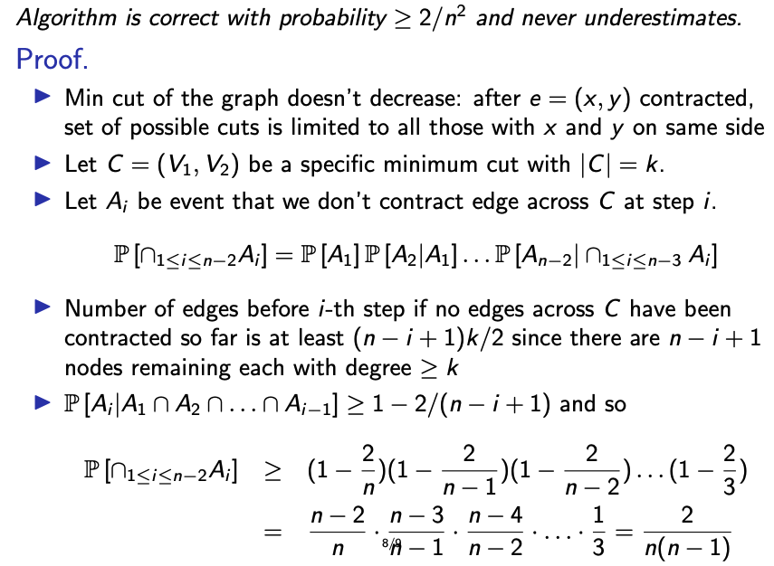

# Karger's Algorithm to find the Minimut cut of an unweighted undirected multi-graph

Given an unweighted undirected multi-graph, a minimum cut is a partitions the vertex set V into V1, V2 such that the number of edges across V1 and V2 is minimized. 

    <figure>
        
        <figcaption>Sample Graph 1.</figcaption>
    </figure>

The Karger's min cut algorithm is a randomized algortihm which computes the correct min cut of an unweighted undirected multi-graph with a probaility of atleast `2/(n^2)`. If we run it sufficient number of times and get the minimum of all runs, we can calculate the correct min-cut. 

## Algorithm

Given, a graph `G(V, E)`.

1. Select a random edge `e` from `E` with endpoints `u` and `v`. 
2. Combine the two vertices into a single vertex.
3. Repeat until there are only 2 vertices left.

## Correctness with low probability.

The probability for corrects follows a mathematical proof. The steps of the proof are as follows, for detailed explanation, refer [Prof. Andrew McGregor's lecture slides](https://people.cs.umass.edu/~mcgregor/611S24/lec14.pdf).

    <figure>
        
        <figcaption>Correctness with low probability.</figcaption>
    </figure>

