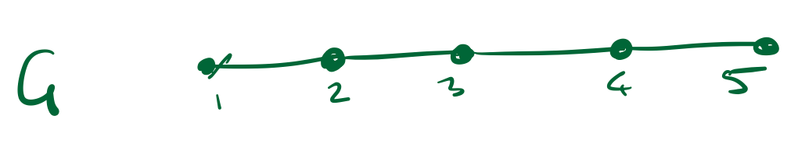

# Seidel's Algorithm

Given an undirected, unweighted graph `G = (V, E)`, the Seidel's algorithm computes distances between all pairs of vertices. It employs matrix multiplication and recursion.

    <figure>
        
        <figcaption>Sample Graph 1.</figcaption>
    </figure>

## Terminology and Notation used in algorithm

* `M_g` - Adjacency matrix of a graph `g`.
* `D_g` - 2D Array, where `D_g[i, j]` represents the distance between `i` and `j`.
* `g2` - Square of a graph `g = (V, E)`, where `g2 = (V, E')` and `(i, j) ∈ E'` iff `D_g[i, j] <= 2`.
* `P_g` - 2D Array, known as parity, where `P_g[i, j] = 1` if `D_g[i, j]` is odd and `0` otherwise.

## Algorithm - Seidel(`M_g`)

1. compute `M_g2`.
2. if all non-diagonal entries of `M_g2[i, j]` are 1, return `D_g` where - 
    * `D_g[i, j]` = 0 if `i==j`
    * `D_g[i, j]` = 1 if `M_g[i, j] ==1`
    * `D_g[i, j]` = 2 otherwise
3. else:
    * compute `D_g2 = Seidel(M_g2)`
    * compute `P_g`
    * return `D_g = 2*D_g2 - P_g`

### Algorithm - compute_parity(`D_g2`, `M_g`)

* Let `X = D_g2 * M_g`
* `P_g[i, j] = 0` if `(X[i, j] / degree_g(j)) >= D_g2[i, j]` 

* Note - `degree_g(j)` represents the number of nodes incident on vertex `j` in graph `g`.

## Time Complexity
1. The matrix mulitiplication operations take `μ(n)` steps, which depends on implementation of matrix multiplication. We can use optimized algorthms which take `O(n^2.3)` steps, for the sake of this implementation, a simple `O(n^3)` steps algorithm is used.
2. The recursion takes `log(n)` steps.
3. Hence, the overall time complexity `T(n)` is  `μ(n)logn`.

### Note

This algithm is taken from Prof. Andrew McGregor's COMPSCI-611 lecture slides. For detailed explanation, refer [Prof. Andrew McGregor's lecture slides](https://people.cs.umass.edu/~mcgregor/611S24/lec10.pdf)